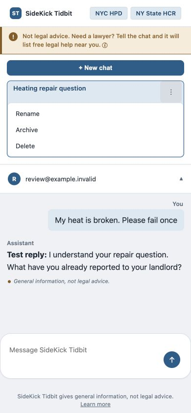

# Push-2 code review and user-flow QA — October 6, 2026

## Scope and release checked

Reviewed the local Push-2 application and exercised the public deployment at
https://tenantrightsandformsassistant.onrender.com using fictional scenarios.
The owner signed into the live site. Destructive account operations and injected
failures were tested with disposable local data, not the owner's live account.
Free-tier model quota exhaustion was excluded as a defect category.

GitHub main was verified against the remote at
`7e7f82ffa4007ae9eeaf6bd6d26ae87e76b0bab5`, the merge of
[PR #52](https://github.com/ChocoAChip2/NYC-Tenant-Assistant/pull/52),
“Public wording says what's true, not how it's built.” The initial checkout was
clean. The fixes described here are **local, uncommitted changes**; they have
not been pushed or deployed. The deployed commit was not independently attested
through Render, so checking GitHub main does not prove the running server's SHA.

## Findings fixed locally

| Priority | Finding and consequence | Change and evidence |
| --- | --- | --- |
| P1 | Starting a second chat deleted an earlier empty chat, including one holding an unsent draft in another tab. The cleanup's capped message query could also misclassify populated conversations; its read/delete sequence had a race. | Removed the automatic sweep entirely. Only an explicit delete removes chats. A two-chat regression now sends successfully to the first chat. |
| P1 | Sign-in and signup used a shared Supabase SDK client whose auth operations mutate session and Authorization state. | These operations now use isolated clients with persistence and auto-refresh disabled. Tests verify the shared client's auth methods are never called. This is a shared-state isolation defect; this review did not demonstrate a live cross-user data disclosure. |
| P1 | Sign-in, signup and account-update failures interpolated raw provider exceptions into public HTML. | Replaced these with safe, actionable messages. Regression exceptions containing an internal URL, table name and secret sentinel never appear in the response. These handlers log only the exception class. |
| P2 | A failed send cleared the draft, appeared as an assistant response, and retrying stored another copy of the user's message. Conversation-lookup outages could return an unhandled error. | Preserve composer text until success, show a separate error alert, prevent repeated submission while pending, reuse an identical unanswered saved turn, and return safe JSON 503 for lookup outages. Browser test: injected failure → retry → reload leaves one user message and one assistant reply. |
| P2 | Conversation/history reads silently stopped at the API row limit, affecting model context and exports. | Added ordered, paginated reads. Tests retain all 1,205 messages and 1,101 conversations. Uses 500-row pages against the standard 1,000-row API cap. |
| P2 | Mobile CSS hid conversation menus and the entire Archived section. | Added visible touch-size controls and an in-flow menu with a scrollable list. At 390×844, archive → open Archived → restore → reopen works. |
| P2 | PDF completion depended on a single automatic download with no visible retry link. | Added a persistent link for the current page, checked HTTP success before treating a response as a PDF, and retained Blob URLs until the page is discarded. Both automatic and manual downloads produced valid two-page forms. |
| P2 | Complete model JSON naming another form could silently become an RA-81. | Reject explicit unsupported form types before rendering. Tests cover alternative and malformed form identifiers. The prompt now distinguishes RA-81, HHW-1 and RA-84. Missing identifiers still default to RA-81 for compatibility. |
| P2 | A source-formatting exception could expose unresolved citation markers. | The fallback strips citations consistently. A fault-injection test checks both the returned and saved response. |
| P2 | Personalized/account pages lacked an explicit cache prohibition. | Auth and signed-in responses now send `Cache-Control: no-store`; tests cover login, reset, chat, settings and chat-history export. |

Additional changes: Enter does not submit during IME composition; malformed or
empty chat responses produce a recoverable error; the model prompt now separates
actions the tenant reported from steps the assistant merely suggested and treats
corrections as replacing earlier facts. The IME guard was inspected, not tested
with a physical input method. Prompt changes are mitigations, not guarantees.

## What users actually did in testing

| Environment | Journey | Result |
| --- | --- | --- |
| Live | Open homepage and search a Bronx building | Returned the matching building, 138 open violations, dated source data and links. This verifies the flow, not the independent accuracy of every external record. |
| Live | Sign in and create a chat | Successful after the owner logged in. |
| Live, real Gemini | Fictional market-rate Queens apartment, broken radiator, landlord already emailed, brief answer requested | Useful next steps and acknowledgment of the landlord email. Initial answer avoided numerical legal claims without retrieved sources. |
| Live, real Gemini | “What about at night?” with a two-sentence constraint | Two sentences and remembered the email, but did not retrieve the specific overnight temperature rule. |
| Live, real Gemini | Explicitly ask for the minimum overnight temperature and a citation | Returned 62°F, 10 p.m.–6 a.m., and a linked §27-2029 citation. |
| Live, real Gemini | Ask whether RA-81 is appropriate for the market-rate case | Correctly declined that form. However, it incorrectly described a suggested 311/HPD complaint as already started. |
| Live, real Gemini | Correct the action history, change to a deposit case, ask for Spanish, three bullets and one question | Switched topic/language and supplied the requested structure. Also added substantial disclaimer text, translated quotations inside quote marks, and cited both deposit-law scopes before resolving regulation status. |
| Live | Fictional lockout/free-lawyer contact-list request after a long break | Generic error in the UI. Reload remained authenticated and showed the saved unanswered user turn. Root cause unconfirmed; not classified as a quota defect or a proven session bug. Referral answer quality remains unverified. |
| Local, disposable services | Inject one model failure; retry and reload | Draft preserved, useful error displayed, successful retry, no duplicate saved turn. |
| Local, disposable services | Mobile archive/restore/reopen | Passed at 390×844. See screenshot below. |
| Local, real PDF renderer | Complete fixture intake, automatic and manual PDF downloads | Both downloaded files parsed as two-page PDFs. Field values, checkboxes and both rendered pages were inspected; no visible clipping in this fixture. |
| Local integration tests | Rename/archive/export/restore/delete; separate-chat context | Passed. Archived content remains in export; deleted chat rejects new messages; another chat's messages do not reach the model. |

## Automated validation and reproducibility

- Baseline: 814 tests ran successfully, one skipped.
- After functional/security fixes: **828 tests ran successfully, one skipped**.
- After the final Learn more wording change: 22 relevant page/template tests passed.
- The skip is the optional ReportLab font-width comparison; ReportLab is absent
  from the existing virtual environment. PDF generation/download and visual QA
  were performed separately and succeeded.
- `git diff --check` passed.
- Existing tests include CSRF rejection, ownership checks, escaping, encryption,
  account-deletion scheduling, validation and PDF field behavior. Passing these
  is not a production penetration test or proof of deployed RLS/configuration.

Run the suite with `venv/bin/python -m unittest discover -s tests`.
For repeatable browser QA, run `venv/bin/python -m tools.review_server` and open
`http://127.0.0.1:5057/login`. Use fictional credentials. The runner binds only
loopback, injects in-memory services and does not require real account creation.
Send `fail once` to exercise retry handling or `test pdf` for the form fixture.
This runner is not imported by the production entrypoint. The review server was
stopped and temporary testing tabs were closed after QA.

## Public inspection and privacy

The rendered-source tests check representative public and signed-in pages for
internal provider/configuration names, secret-key identifiers, algorithm details,
tracebacks and served comments. Authentication failures are tested separately
with sensitive-looking sentinels. Requests for `.env`, Git configuration, Python
source, a raw template, internal documentation and a migration path return 404
in application tests. These are local application checks, not assertions about
every possible deployment/proxy route.

Public notes now describe account purpose and user controls. The Learn more page
retains actionable export/deletion information without publishing implementation
details or making an unconditional encryption claim. Deletion timing remains
visible because it matters to the user's choice.

Browser-delivered HTML/JavaScript, endpoint URLs and a user's own visible data
remain inspectable by design. Removing comments or wording cannot replace
authorization, CSRF protection, output escaping or secret management. Repository
visibility was not changed. This review does not replace an accurate privacy
notice describing material data uses; sensitive operational details do not belong
in such a notice.

## Tailoring: prioritized product changes

### 1. Give each case an editable facts panel

Add a compact “Your situation” panel beside chat: borough, issue, when it began,
regulation status (including **I don't know**), desired outcome, and actions
actually taken with dates. Treat these as tenant-confirmed facts, distinguish
them from suggested next steps, and let the tenant correct or clear them.
Use separate case records when the user starts a different problem.

This directly addresses the observed invented 311 action. Conversation history
alone does not reliably distinguish plans from completed actions. Do not assume
that a building's registration proves the apartment is rent stabilized. Do not
send the full profile or date of birth merely to make prose sound personalized.

### 2. Retrieve sources using the active case, not just the latest sentence

`_ground_reply` currently calls `retriever.search(question)` with only the current
message. The model receives chat history, but the retrieval query does not.
“What about at night?” therefore has much less legal context than the explicit
temperature question that worked in testing.

Build a bounded retrieval query from the current request and confirmed issue,
jurisdiction and housing status. A deterministic context string can improve this
without an extra paid model call. Reset or switch context on topic changes; do
not blindly attach the whole old conversation to every search.

### 3. Let users choose the response they need

Offer optional controls for language, short/detailed answers, and the goal:
understand rights, choose next steps, draft a landlord message, prepare a form, or
find help. Persist explicit preferences; allow per-turn overrides. Ask one
necessary clarification at a time and make “unknown” a supported answer.

Keep the safety notice concise rather than duplicating it in both generated
prose and the page. For urgent deadlines/lockouts, show an owner-reviewed help
card independently of model availability, using the existing maintained resource
list. The last live referral test did not establish whether the model reliably
provides this list.

### 4. Connect building lookup to chat with explicit confirmation

Offer “Use this building in my chat.” Pass a bounded server-side snapshot keyed
to the confirmed building identity, with retrieval date and source links. Label
official building records separately from the tenant's description. Include only
relevant violations, not the entire dataset, and make the selected building easy
to correct. Apartment status and unit-specific conditions remain separate facts.

### 5. Make source applicability and translation explicit

Tag legal sources by jurisdiction, effective version and applicability, including
rent-regulated versus other units. Retrieve and cite the applicable scope, or
ask first when unknown. In the Spanish test, §7-107 and §7-108 were both cited
before the assistant established which scope applied. Both sections exist; this
is an applicability issue, not evidence that §7-107 is obsolete.

When exact quotations are useful, retain the original text and label its
translation. A translated sentence cannot pass a literal English-source quote
check merely because it conveys a similar meaning. Measure multilingual
verification rather than relaxing the validator wholesale. Citation enforcement
currently strips unverified citations; it does not prove all remaining prose.

### 6. Put review and eligibility before form generation

Add a server-controlled review screen showing the selected form, eligibility
answers and every populated field before the tenant chooses Download. Require
actual confirmation; prompt instructions alone are insufficient. HCR distinguishes
individual decreased services (RA-81), individual heat/hot-water complaints
(HHW-1) and building-wide complaints (RA-84). Current route checks stop an
explicitly different form from silently turning into RA-81, but do not establish
eligibility independently of model output.

Plan controlled storage/re-download of generated documents with ownership checks
and deletion integration. Currently the new link survives only within the
current page; a fresh reload cannot recreate the downloaded artifact.

## Remaining technical risks and follow-up acceptance criteria

- **Concurrent turns:** the new retry check handles sequential retries of the
  same unanswered message. Cross-tab concurrent requests, or a lost response
  after the assistant reply was saved, still need request IDs and atomic turn
  state/serialization. Acceptance: two simultaneous sends or a replay produce
  exactly the intended turns and at most one result per request ID.
- **Timeouts:** the browser send has no explicit end-to-end deadline. Bound
  upstream work and present a recoverable timeout, coordinated with idempotency
  so retries do not generate duplicate results.
- **Non-Latin PDFs:** the renderer uses WinAnsi/cp1252 with replacement, so
  unsupported names/text can become question marks. Code inspection confirms
  the limitation; the successful visual fixture used supported Latin text.
  Use embedded fonts with adequate glyph coverage and validate multilingual
  names and room descriptions before claiming multilingual form support.
- **Large histories:** pagination fixes API truncation, but total history still
  grows. Define bounded model context and durable confirmed facts, and move
  large exports off the interactive request path when necessary. Current
  pagination assumes the configured API cap is at least 500 rows.
- **Grounding:** report-mode violations are logged without altering the reply;
  enforce mode removes citations rather than repairing unsupported claims.
  Evaluate claim support and applicability, not just presence of a source chip.
- **Release verification:** run the patched build against staging auth/database
  services, then repeat retry, mobile actions and PDF download after deployment.
  Mocks do not verify production policies, secrets, proxy configuration or
  platform timeouts. No production changes were made during this review.

Before expanding AI behavior, add a small repeatable evaluation set covering
short follow-ups, corrected facts, suggested-versus-completed actions, unknown
regulation status, deposits under both scopes, form selection, Spanish answers,
urgent help requests, topic changes and prompt injection. Score factual fidelity,
source applicability, preference compliance and whether the next action is
usable. Improve these with the current Flash model before spending on an upgrade.

## Primary references checked

- [Supabase Python select](https://supabase.com/docs/reference/python/select)
  and [range](https://supabase.com/docs/reference/python/range): default cap and
  ordered inclusive pagination.
- [NYC HPD heat and hot water](https://www.nyc.gov/site/hpd/services-and-information/heat-and-hot-water-information.page):
  reference for the overnight heat scenario.
- [NY GOB §7-107](https://www.nysenate.gov/legislation/laws/GOB/7-107) and
  [§7-108](https://www.nysenate.gov/legislation/laws/GOB/7-108): distinct deposit-law scopes.
- [HCR living conditions and essential services](https://hcr.ny.gov/living-conditions-and-essential-services)
  and [official RA-81](https://hcr.ny.gov/form-ra-81): form selection and current template.

These references supported product QA and form routing. This report is not an
individual tenant's legal assessment.
